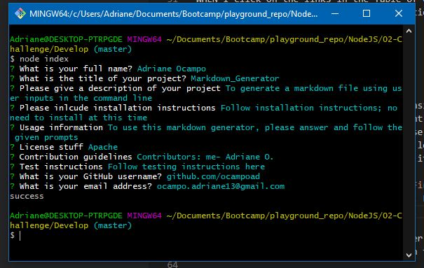

# Project Name - Markdown Generator
​
## Table of contents
​
- [Overview](#overview)
  - [The challenge](#the-challenge)
  - [User Story](#user-story)
  - [Acceptance Criteria](#acceptance-criteria)
  - [Screenshot](#screenshot)
  - [Links](#links)
- [My process](#my-process)
  - [Built with](#built-with)
  - [What I learned](#what-i-learned)
  - [Continued development](#continued-development)
  - [Useful resources](#useful-resources)
- [Author](#author)


## Overview
​
### The challenge
​
This week's challenge inlude creating a command-line application that will generate a README markdown file using user inputs
​
### User Story
​
```
AS A developer
I WANT a README generator
SO THAT I can quickly create a professional README for a new project
```
​
### Acceptance Criteria
​
```
GIVEN a command-line application that accepts user input
WHEN I am prompted for information about my application repository
THEN a high-quality, professional README.md is generated with the title of my project and sections entitled Description, Table of Contents, Installation, Usage, License, Contributing, Tests, and Questions
WHEN I enter my project title
THEN this is displayed as the title of the README
WHEN I enter a description, installation instructions, usage information, contribution guidelines, and test instructions
THEN this information is added to the sections of the README entitled Description, Installation, Usage, Contributing, and Tests
WHEN I choose a license for my application from a list of options
THEN a badge for that license is added near the top of the README and a notice is added to the section of the README entitled License that explains which license the application is covered under
WHEN I enter my GitHub username
THEN this is added to the section of the README entitled Questions, with a link to my GitHub profile
WHEN I enter my email address
THEN this is added to the section of the README entitled Questions, with instructions on how to reach me with additional questions
WHEN I click on the links in the Table of Contents
THEN I am taken to the corresponding section of the README
```
​
### Screenshot
​

​
​
### Links
​
- Recording: [https://drive.google.com/file/d/1YS_pSrHDjxUeDOV7c7B5gnDGLcZplQSO/view](https://drive.google.com/file/d/1YS_pSrHDjxUeDOV7c7B5gnDGLcZplQSO/view)
​
## My process
​
### Built with
​
- Javascript
- NPM:
    - Inquirer
    - Fs
- module.exports
- Moment.js
​

​
### What I learned
​
I learned how to use some of NPM packages. The main ones I used in this challenge are Inquirer and FS. The NPM documentation for each package does vary in detail but they are helpful in figuring out how to use. 

### Continued development
​
There are other packages I tried using that I found out I did not need for this challenge. Some of those package include a fetch() and jquery packages. 
​
### Useful resources
​
- [NPM Inquirer](https://www.npmjs.com/package/inquirer) - Documentation helped me understand how to use this package
- [Stackoverflow](https://stackoverflow.com/) - Great resource of other developers helping other developers. They answered specific questions others have encountered. 
- [lukas-h/ license.badges.md](https://gist.github.com/lukas-h/2a5d00690736b4c3a7ba) - Provided lists of license badges to use for README
​
## Author
​
- Website - [Adriane Ocampo](https://ocampoad.github.io/Adriane_Ocampo_Portfolio/)
​

